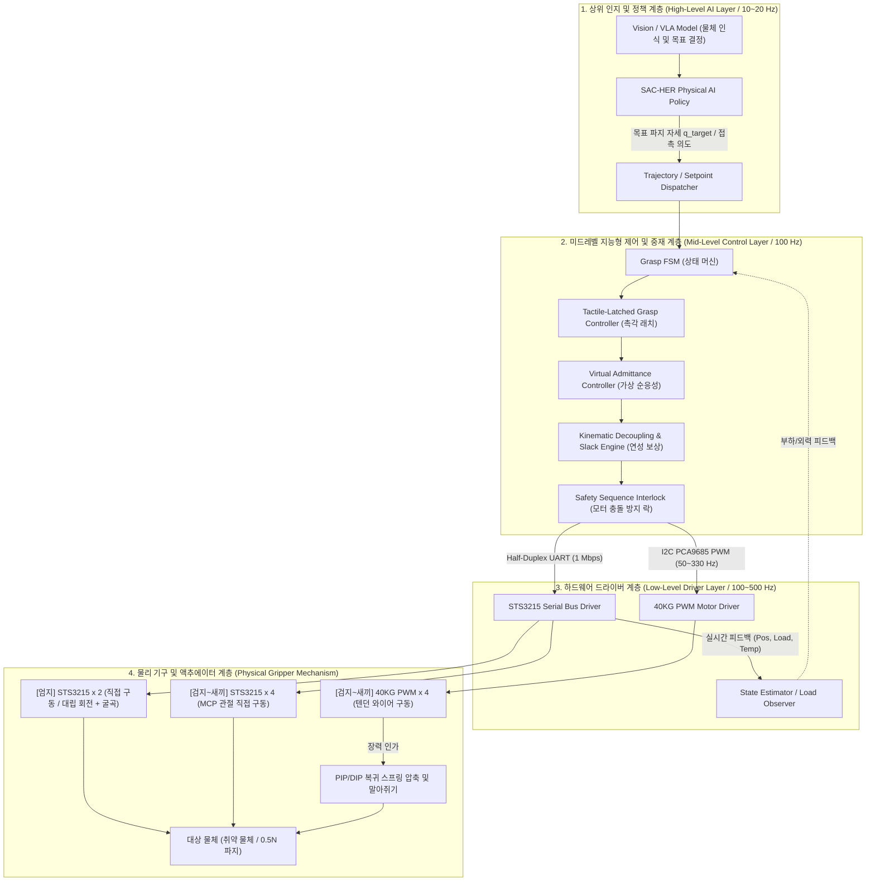
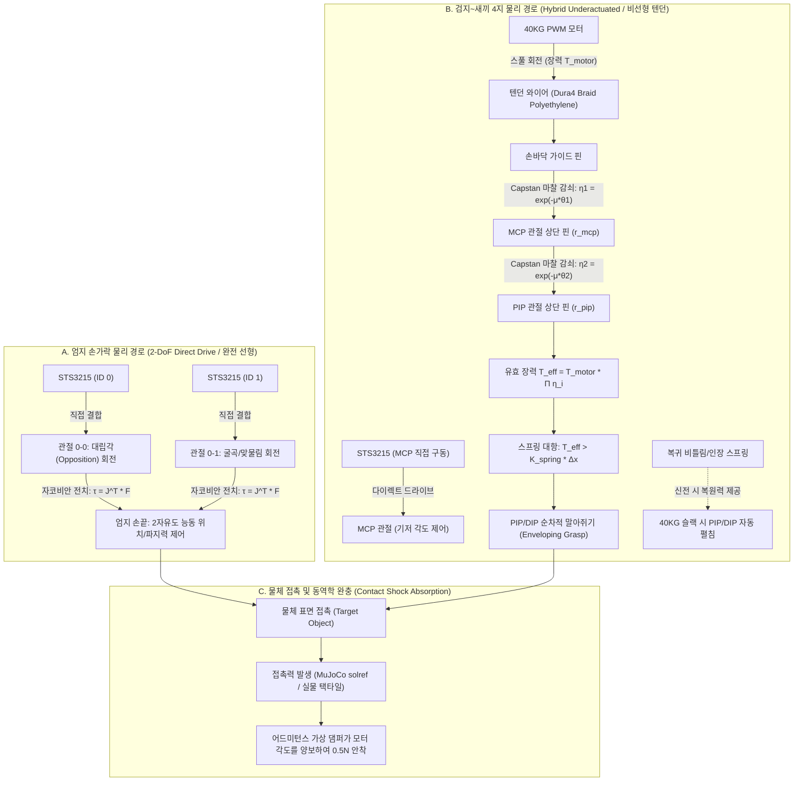
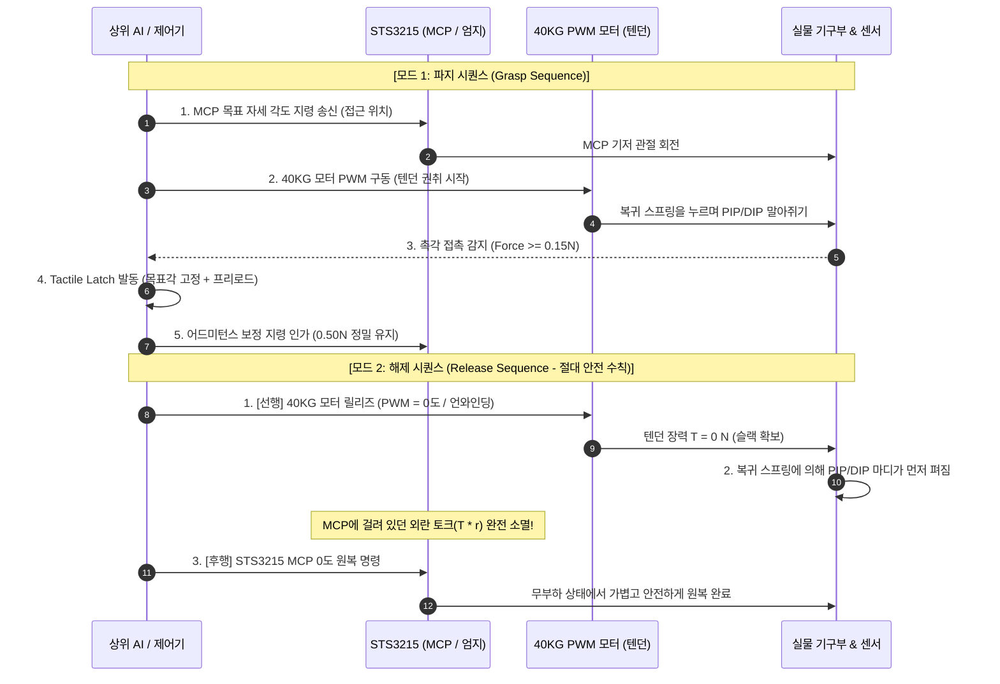
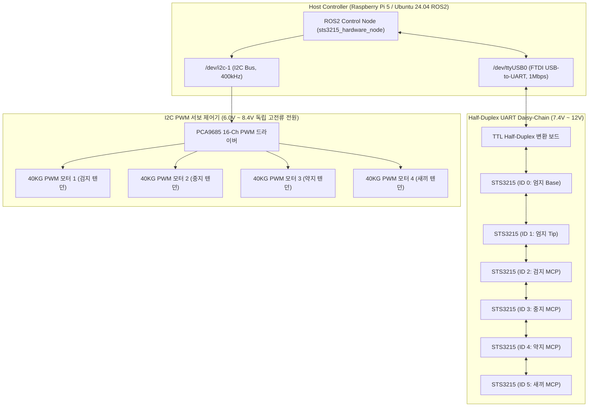

# 5지 로봇 그리퍼 통합 시스템 파이프라인 블루프린트
(Full System Pipeline Blueprint: Software & Physical Architecture)

**문서 번호**: AI-PRIORITY-PIPE-20260922  
**작성자**: AI 제어 수석 연구원 (팀 3 제어팀)  
**대상**: 팀 미팅 보고 및 전 팀(1팀 기구, 2팀 회로, 3팀 제어, 4팀 비전) 공통 공유용 SSOT (Single Source of Truth)

---

## 1. 종합 시스템 아키텍처 개요 (System Overview)

본 시스템은 **시각/AI 상위 의사결정 계층**, **하위 실시간 지능 제어 계층**, 그리고 **생체모방 하이브리드 기구부(직접 구동 + 언더액추에이티드 텐던)**로 구성된 3계층 피지컬 AI(Physical AI) 로봇 핸드입니다.

---

## 2. [소프트웨어 파이프라인] (Software Pipeline)

소프트웨어 파이프라인은 상위의 불확실한 AI 지령을 하위의 엄밀한 물리 법칙 및 안전 제약 내에서 제어 가능한 명령으로 변환하는 다단계 필터링 구조를 가집니다.

```mermaid
flowchart LR
    subgraph S1["Step 1. 관측 (Sensing)"]
        Raw_UART["STS3215 엔코더 / 부하(Load)"] --> Obs_Builder
        Raw_Tactile["손끝 택타일 센서 / 외력(F_ext)"] --> Obs_Builder
        Obs_Builder["3D 상태 정규화: qpos, force, slip"]
    end

    subgraph S2["Step 2. 판단 (Decision)"]
        Obs_Builder --> Policy["SAC Actor Policy (actor_v6_step_150000.pth)"]
        Policy --> Raw_Cmd["공칭 목표 각도 (mu)"]
    end

    subgraph S3["Step 3. 중재 (Arbitration & Compliance)"]
        Raw_Cmd --> Latch["Tactile Latch (F >= 0.15N 감지 시 고정)"]
        Latch --> Admittance["Admittance Control: M d2(e) + D d(e) + K e = -(F_ext - 0.5N)"]
        Admittance --> TDPA["TDPA 가변 댐핑 소산 (통신 지연 발진 방지)"]
    end

    subgraph S4["Step 4. 분배 및 안전 락 (Safety & Dispatch)"]
        TDPA --> Decouple["기구학 연성 보상: ΔL = r_mcp * Δq_mcp"]
        Decouple --> Interlock{"동작 모드 판단"}
        Interlock -- "파지(Grasp)" --> Seq_Close["MCP 각도 선행 -> 40KG 텐던 당김"]
        Interlock -- "해제(Release)" --> Seq_Open["[1단계] 40KG 슬랙 선행 -> [2단계] STS 원복"]
    end

    subgraph S5["Step 5. 모터 인가 (Actuation)"]
        Seq_Close & Seq_Open --> Cmd_STS["STS3215 위치 패킷 송신 (0x2A)"]
        Seq_Close & Seq_Open --> Cmd_PWM["PCA9685 PWM 펄스 폭 인가 (Max 25% 제한)"]
    end
```

### 2.1 주요 제어 알고리즘 세부 사양

| 모듈명 | 주기 | 입력 데이터 | 출력 데이터 | 핵심 역할 및 수식 |
|:---|:---:|:---|:---|:---|
| **Tactile Latch** | 100 Hz | $F_{ext}$, $q_{mcp}$ | $q_{ref}$ | 접촉 시 목표각을 $q_{contact} + 1.4^\circ$로 래칭하여 뒤로 튕기는 핑퐁 원천 차단 |
| **Admittance** | 100 Hz | $F_{ext}$, $F_{des}(0.5\text{N})$, $q_{ref}$ | $x_{cmd}, v_{cmd}$ | $M_d \ddot{e} + D_d \dot{e} + K_d e = -(F_{ext} - F_{des})$ ($K_d=5.0, D_d=1.5$) |
| **Kinematic Decoupler** | 100 Hz | $\Delta q_{mcp}$ | $\Delta \theta_{40KG}$ | MCP 회전에 따른 텐던 유효 길이 변화 보상: $\Delta L = r_{mcp} \Delta q_{mcp}$ |
| **Sequence Interlock** | 이벤트 | State (Grasp / Release) | Motor Enable Flags | 손가락 펼 때 **[40KG 텐던 슬랙 선행 $\to$ STS3215 원복]** 강제 |
| **Torque Clamp** | 100 Hz | PWM Duty | Clamped PWM | 40KG 모터 최대 토크를 $25\%\sim30\%$ (약 $8\sim10\text{ kgf}$)로 소프트웨어 리미트 |

---

## 3. [물리 및 기구 파이프라인] (Physics & Hardware Pipeline)

물리 파이프라인은 모터의 회전 운동이 텐던, 풀리, 스프링, 그리고 마찰을 거쳐 최종적으로 물체에 부드러운 수직 항력($0.5\text{ N}$)으로 전달되는 기구학/동역학 경로입니다.

### 3.1 손가락 구조별 물리 전달 경로

### 3.2 물리 파라미터 및 하드웨어 링크 규격 (SSOT)

1. **엄지 손가락 (Finger 0)**:
   - `0-0` (Base) ~ `0-1` (Joint 1): 길이 $L_{t1} = 0.045\text{ m}$ (45 mm)
   - `0-1` ~ 끝점 (Tip): 길이 $L_{t2} = 0.035\text{ m}$ (35 mm)
   - 구동: STS3215 2개 직렬 직접 구동, 텐던 없음.

2. **일반 손가락 (Fingers 1~4)**:
   - MCP ~ PIP (Proximal Link): $L_{prox} = 0.040\text{ m}$ (40 mm)
   - PIP ~ DIP (Middle Link): $L_{mid} = 0.0158\text{ m}$ (15.8 mm)
   - DIP ~ 끝점 (Distal Link): $L_{dist} = 0.0155\text{ m}$ (15.5 mm)
   - 텐던 연동 커플링: $\theta_{DIP} = 0.88 \cdot \theta_{PIP}$ (생체모방 기구학적 종속)
   - PIP 복귀 스프링: 관절 마찰을 이기고 손가락을 펴주는 상시 신전 토크 인가.

3. **마찰 및 장력 특성 (논문 56번 공식 반영)**:
   - 텐던 재질: 고분자 폴리에틸렌 (Dura4 Braid), 마찰계수 $\mu \approx 0.2$
   - 라우팅 핀 마찰: $\eta_{routing} = e^{-\mu \theta} \approx 0.5 \sim 0.7$ (각도에 따라 30~50% 장력 손실)
   - 40KG 모터의 역할: **스프링 강성($F_{spring}$) + 핀 마찰 손실($\Delta F_{friction}$)을 이기고 손끝에 $5\sim 10\text{ N}$을 가하기 위한 충분한 토크 마진 확보**.

---

## 4. [동작 시퀀스 및 안전 인터락] (State Sequence & Interlock)

모터 간 충돌(STS3215 기어 파손)을 100% 방지하기 위한 소프트웨어 상태 머신(FSM) 타임라인입니다.

---

## 5. [전기 및 통신 파이프라인] (Hardware Wiring & Bus Architecture)

> [!IMPORTANT]
> **전원 분리 원칙 (Power Isolation Rule)**:
> 40KG 모터 4개가 동시에 당길 때 발생하는 피크 전류(최대 $10\sim15\text{ A}$)가 STS3215 및 라즈베리파이 로직 전원으로 역류하지 않도록, **40KG 서보 전원(고전류 7.4V SMPS/배터리)**과 **제어기/STS3215 전원은 반드시 그라운드(GND)만 공통으로 묶고 VCC 라인은 완벽히 분리**해야 합니다.

---

## 6. 팀별 협업 인계 체크리스트 (Action Items for Teams)

1. **팀 1 (기구팀)**:
   - [x] 엄지손가락: STS3215 2개 직렬 직접 구동 확인 (텐던 불필요)
   - [x] 일반 손가락: PIP 상단 텐던 라우팅 및 복귀 스프링 장착 확인
   - [ ] 텐던이 MCP 관절 축을 통과할 때의 모멘트 암($r_{mcp}$) 정밀 치수(mm) 공유 필요.
2. **팀 2 (회로/전원팀)**:
   - [ ] STS3215 시리얼 라인(1Mbps)과 PCA9685 I2C 라인 배선 분리.
   - [ ] 40KG 모터 순간 피크 전류(15A) 대응 대용량 캐패시터 및 독립 전원 레일 구축.
3. **팀 3 (제어팀 - 우리)**:
   - [x] 1지 MVP 15만 회 훈련 및 촉각 래치 파지 알고리즘 검증 완료 ($0.5\text{ N}$ 안착, 파손율 $0\%$).
   - [x] ADR 004 (3D 뷰어 동결) 및 ADR 005 (텐던 연성 및 해제 시퀀스 락) 수립 완료.
   - [ ] C++ ROS2 노드에 `[40KG 슬랙 선행 -> STS 원복]` 시퀀스 인터락 및 피드포워드 슬랙 보상 구현.
4. **팀 4 (비전/상위팀)**:
   - [ ] 물체 위치 및 크기($1.5\text{cm} \sim 4.0\text{cm}$) 추정 토픽 규격 확정 (`/target_object_info`).
