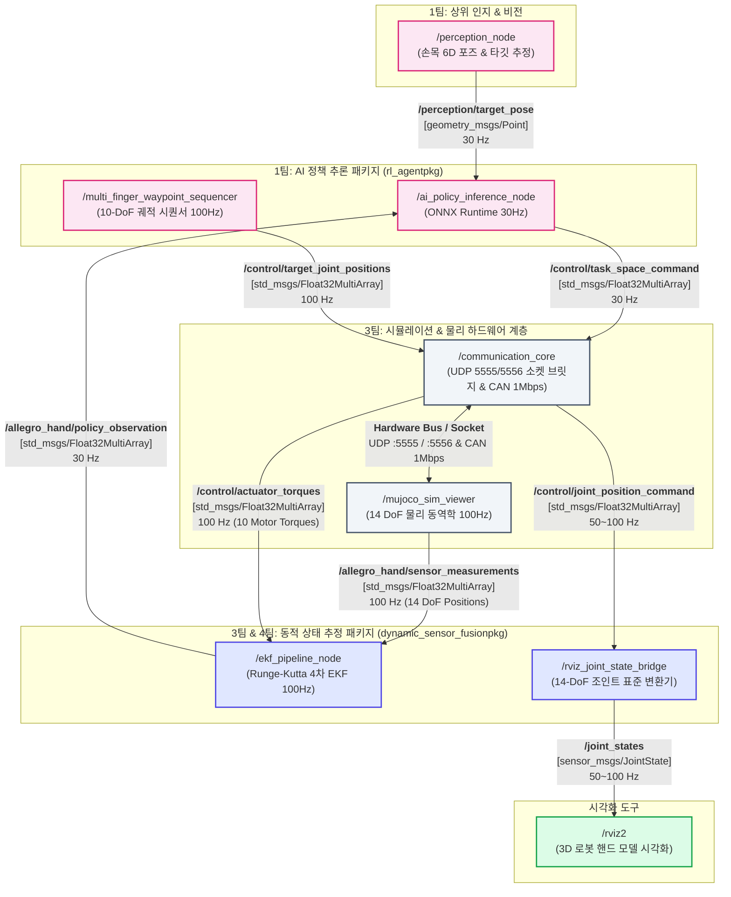

# 14 DoF 로봇 핸드 ROS 2 파이프라인 아키텍처 명세서 (ROS2_PIPELINE_ARCHITECTURE)

본 문서는 **14 DoF / 10-Actuator 바이오닉 로봇 핸드** 시스템의 **ROS 2 Humble 기반 분산 제어 파이프라인** 아키텍처를 정의합니다. GitHub 리포지토리의 메인 문서 또는 기술 위키에 즉시 등록하여 4대 협업 팀(비전/기구/제어/촉각)이 공유할 수 있도록 표준 사양을 명세합니다.

---

## 1. ROS 2 계산 그래프 (ROS 2 Computation Graph)

GitHub 마크다운에서 네이티브로 렌더링되는 다이어그램입니다. 상위 인공지능 정책(RL/VLA), 비선형 상태 추정기(EKF), 시각화 브릿지(RViz2), 물리 시뮬레이터 및 하드웨어 통신 계층의 데이터 흐름을 나타냅니다.



---

## 2. ROS 2 노드 상세 명세표 (Node Specifications)

| 패키지명 (Package) | 노드명 (Node) | 실행 파일 (Executable) | 주요 역할 및 핵심 알고리즘 | 담당 팀 |
| :--- | :--- | :--- | :--- | :---: |
| **`rl_agentpkg`** | `/ai_policy_inference_node` | `ai_policy_inference_node.py` | • ONNX Runtime 기반 고속 정책 추론 (30 Hz)<br>• 관측(20D) + 목표 포즈(3D) 수신 $\to$ 작업 공간 증분 $\Delta x$ (5D) 산출 | 1팀 (VLA/AI) |
| **`rl_agentpkg`** | `/multi_finger_waypoint_sequencer` | `multi_finger_waypoint_sequencer.py` | • 10-DoF 텐던/관절 다지(Multi-finger) 궤적 생성기 (100 Hz)<br>• 4단계 파지 시퀀스(전개-중간-완전파지-복귀) 5차 다항식 보간 | 1팀 / 3팀 |
| **`dynamic_sensor_fusionpkg`** | `/ekf_pipeline_node` | `ekf_node.py` | • Runge-Kutta 4차 비선형 상태 예측 및 칼만 필터 게인 업데이트 (100 Hz)<br>• 14 DoF 센서 실측치 + 10ch 토크 융합 $\to$ 28D 상태($q, \dot{q}$) 추정 | 3팀 / 4팀 |
| **`dynamic_sensor_fusionpkg`** | `/rviz_joint_state_bridge` | `rviz_joint_state_bridge.py` | • 14 DoF 비정형 배열을 표준 ROS 2 `JointState` 메시지로 변환 (100 Hz)<br>• 정확한 헤더 타임스탬프 주입 및 조인트 네임스페이스(`joint_0_0`~`13_0`) 동적 생성 | 3팀 (통신/제어) |
| **`dynamic_sensor_fusionpkg`** | `/mujoco_sim_viewer` | `mujoco_sim_viewer.py` | • MuJoCo 물리 엔진 기반 14 DoF 시뮬레이션 및 관절 위치(14) 스트리밍 (100 Hz) | 3팀 (통신/제어) |
| **`communication_core`** | `/communication_core` | `socket_server.py`<br>`mujoco_comm_bridge.py` | • 실시간 텔레메트리 송출 (UDP 5555, 100 Hz) & 지령 수신 (UDP 5556, 100 Hz)<br>• 100ms 안전 워치독(Safe-torque fallback: 0.0 Nm) 및 토크 클램퍼 | 3-A (주축 허브) |

---

## 3. ROS 2 공식 토픽 인터페이스 협약표 (Topic Interface Contract)

전 협업 팀이 준수해야 하는 토픽 이름, 메시지 타입, 발행 주기, QoS 및 페이로드 데이터 규격입니다.

| 토픽 이름 (Topic Name) | 메시지 타입 (Message Type) | 발행 주기 | 발행자 (Pub) | 구독자 (Sub) | QoS 정책 | 페이로드 사양 및 데이터 범위 |
| :--- | :--- | :---: | :---: | :---: | :---: | :--- |
| **`/allegro_hand/sensor_measurements`** | `std_msgs/Float32MultiArray` | **100 Hz** | `/mujoco_sim_viewer` | `/ekf_pipeline_node` | Best Effort / Depth 10 | 14개 관절 각도 실측값 (`rad`)<br>`data[0:14] = [q_0, ..., q_13]` |
| **`/control/actuator_torques`** | `std_msgs/Float32MultiArray` | **100 Hz** | `/communication_core` | `/ekf_pipeline_node` | Reliable / Depth 10 | 10개 구동기 토크 피드백 (`Nm`)<br>`data[0:10] = [tau_0, ..., tau_9]` |
| **`/allegro_hand/ekf_estimated_states`** | `std_msgs/Float32MultiArray` | **100 Hz** | `/ekf_pipeline_node` | `/rl_agentpkg` / 제어기 | Reliable / Depth 10 | 28차원 추정 상태 벡터<br>`data[0:14]` = 위치($q$), `data[14:28]` = 속도($\dot{q}$) |
| **`/allegro_hand/policy_observation`** | `std_msgs/Float32MultiArray` | **30 Hz** | `/ekf_pipeline_node` | `/ai_policy_inference_node` | Reliable / Depth 10 | 20차원 정책 관측 벡터 (손끝 위치, 정규화된 관절각 등) |
| **`/perception/target_pose`** | `geometry_msgs/Point` | **30 Hz** | 1팀 비전 노드 | `/ai_policy_inference_node` | Reliable / Depth 10 | 3차원 파지 대상 물체 좌표 (`x, y, z` in meters) |
| **`/control/task_space_command`** | `std_msgs/Float32MultiArray` | **30 Hz** | `/ai_policy_inference_node` | `/communication_core` | Reliable / Depth 10 | 5개 손가락 끝 작업 공간 변위 증분 ($\Delta x \in \mathbb{R}^5$) |
| **`/control/target_joint_positions`** | `std_msgs/Float32MultiArray` | **100 Hz** | `/multi_finger_waypoint_sequencer`| `/communication_core` | Reliable / Depth 10 | 10-DoF 관절 목표 각도 (`rad`) (Quintic spline) |
| **`/control/joint_position_command`** | `std_msgs/Float32MultiArray` | **100 Hz** | `/communication_core` | `/rviz_joint_state_bridge` | Best Effort / Depth 10 | 14-DoF 전체 관절 위치 지령 에코값 (`rad`) |
| **`/joint_states`** | `sensor_msgs/JointState` | **100 Hz** | `/rviz_joint_state_bridge` | `/rviz2` | Reliable / Transient Local | 표준 RViz2 렌더링 메시지 (헤더 타임스탬프, 조인트 이름 14개, 위치 14개) |

---

## 4. 4대 협업 팀 식별 ID ([IF-01] ~ [IF-07B]) 대응표

| 인터페이스 ID | ROS 2 / 통신 채널 | 데이터 내용 및 프로토콜 | 주기 | 비고 |
| :---: | :--- | :--- | :---: | :--- |
| **`[IF-01]`** | 파일 시스템 | `assets/meshes/*.STL` (44개), `assets/models/*.xml` | 변경 시 즉시 | 2팀 $\to$ 3팀 에셋 단일화 |
| **`[IF-02]`** | CAN Bus / Serial | 10개 모터 원시 패킷 (1 Mbps) / STS3215 RS-485 | 100 Hz | 3팀 $\leftrightarrow$ 2팀 모터 버스 |
| **`[IF-03]`** | UDP Port 5555 | JSON: `q[14]`, `dq[14]`, `torque[10]` | 100 Hz | 3-A 통신 코어 $\to$ 3-B 제어 코어 |
| **`[IF-04]`** | UDP Port 5556 | JSON: `torques[10]` (워치독 100ms 안전 차단) | 100 Hz | 3-B 제어 코어 $\to$ 3-A 통신 코어 |
| **`[IF-05A]`**| ZeroMQ / Tensor | 촉각 특징 임베딩 ($z_{\text{tac}} \in \mathbb{R}^{D}$) | 30~100 Hz | 4팀 $\to$ 1팀 VLA 직결 |
| **`[IF-05B]`**| UDP / Fast Signal | 슬립 감지 플래그 (`slip_detected[5]`) | **< 20 ms** | 4팀 $\to$ 3-B 제어 코어 비상 반사 |
| **`[IF-06]`** | GPU Direct VRAM | 비전 패치 임베딩 ($z_{\text{vis}}$) & 6D 손목 포즈 | 30~60 Hz | 1팀 내부 ViT $\to$ VLA 직결 |
| **`[IF-07A]`**| UDP Port 5559 | 관절 프로프리오셉션 (`q[14]`, `dq[14]`) | 20~30 Hz | 3팀 $\to$ 1팀 VLA State 토크나이저 |
| **`[IF-07B]`**| UDP Port 5559 | `/control/task_space_command` (VLA 액션 목표) | 10~30 Hz | 1팀 VLA $\to$ 3-B 제어 코어 |

---

## 5. 빌드 및 파이프라인 기동 방법 (Build & Launch Workflow)

### 1) 워크스페이스 빌드 (colcon symlink)
```bash
cd /root/ros2_ws
source /opt/ros/humble/setup.bash

# 핵심 패키지 2종 릴리즈 빌드
colcon build --symlink-install \
             --packages-select dynamic_sensor_fusionpkg rl_agentpkg \
             --cmake-args -DCMAKE_BUILD_TYPE=Release

# 오버레이 환경 로드
source install/setup.bash
```

### 2) 전체 통합 시스템 원클릭 자동 기동
```bash
# 디스플레이 바인딩, 빌드 검증, MuJoCo 뷰어 및 소켓 브릿지 일괄 기동 스크립트
bash run_gripper_system.sh
```

### 3) 개별 ROS 2 노드/런치 실행
```bash
# EKF 상태 추정 파이프라인 가동
ros2 launch dynamic_sensor_fusionpkg ekf.launch.py

# ONNX AI 추론 노드 독립 실행
ros2 run rl_agentpkg ai_policy_inference_node.py

# RViz2 조인트 상태 브릿지 가동
ros2 run dynamic_sensor_fusionpkg rviz_joint_state_bridge.py
```
