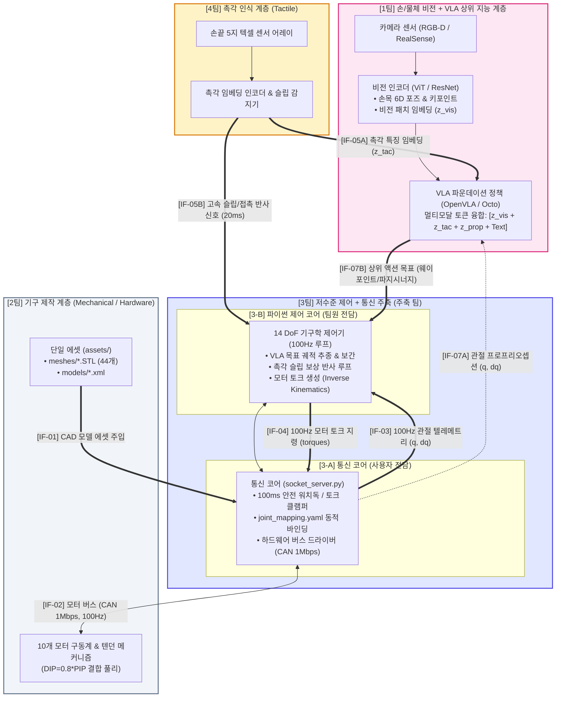

# 14 DoF 그리퍼 다중 팀 통합 데이터 플로우 & 아키텍처
## [개정판: 멀티모달 임베딩 직결 및 정상화된 계층형 데이터 통로]

본 문서는 **1팀(손/물체 비전 + VLA 상위 지능)**, **2팀(기구 제작)**, **3팀(저수준 제어 + 통신 주축)**, **4팀(촉각 인식)** 간의 올바른 신호 흐름과 **임베딩(Embedding) / 물리 제어 통로 분리**를 명시한 전체 시스템 아키텍처 문서입니다.

---

## 1. 데이터 통로(Pathway) 왜곡 원인과 정상화 원칙

### A. 기존 설계의 치명적 오류 분석
1. **1팀 내부 비전 데이터의 기형적 U턴 (순환 우회로)**:
   - 1팀은 **"비전 인식"**과 **"VLA 상위 지능"**을 동일 팀에서 전담합니다.
   - 기존 통로는 카메라 영상/포즈 데이터를 3팀 통신 코어(UDP 5558)로 내려보낸 뒤, 이를 다시 1팀 VLA(UDP 5559)로 쏘아 올리는 불필요하고 비상식적인 우회로를 가지고 있었습니다.
2. **3팀(통신 코어)의 병목화 및 실시간성 파괴**:
   - 3팀 통신 코어의 핵심 임무는 **100Hz(10ms) 주기 모터 제어(CAN 1Mbps 버스), 텐던-관절 변환, 100ms 워치독 보호**입니다.
   - 고용량 비전 데이터나 촉각 텍셀 데이터를 3팀이 모아서 직렬화/중계하는 '멀티모달 브로커' 역할을 맡기면 10ms 실시간성이 붕괴됩니다.
3. **"임베딩(Embedding)" 파이프라인의 몰이해**:
   - VLA(OpenVLA, Octo 등)는 Transformer 기반 거대 멀티모달 모델로, **비전 패치 임베딩($z_{\text{vis}}$)**과 **촉각 잠재 토큰($z_{\text{tac}}$)**을 직접 입력받습니다.
   - 이 고차원 임베딩 텐서는 GPU VRAM 상에서 **Direct In-Memory**로 처리되거나 팀 간 고속 IPC로 직결되어야 하며, 저수준 모터 제어 소켓을 통과하는 것은 기술적으로 불가능하고 비효율적입니다.

### B. 정상화 원칙 (상위 지능 루프 vs 하위 물리 제어 루프 분리)
- **상위 인지 & 임베딩 루프 (1팀 & 4팀)**:
  - 카메라 $\rightarrow$ 비전 인코더 $\rightarrow$ VLA 파운데이션 모델은 **1팀 내부 GPU VRAM 상에서 직접 주입 (`[IF-06]`)**.
  - 4팀 촉각 특징 임베딩($z_{\text{tac}}$)은 **1팀 VLA로 직접 전송 (`[IF-05A]`)**.
- **하위 물리 제어 & 반사 루프 (3팀 & 4팀 & 2팀)**:
  - 4팀의 슬립(Slip) 감지 신호는 낙하 방지를 위해 **3-B 제어기로 직결 (`[IF-05B]`, < 20ms 반사 제어)**.
  - VLA의 상위 액션 목표(손끝 웨이포인트/시너지)는 **3-B 제어기로 하달 (`[IF-07B]`)**되어 100Hz 궤적으로 보간.
  - 3-A 통신 코어는 VLA에 관절 프로프리오셉션($q, \dot{q}$) 피드백만 제공 (`[IF-07A]`)하고, 모터 구동계와의 100Hz CAN 버스 (`[IF-02]`)에 전념.

---

## 2. 정상화된 다중 팀 데이터 플로우 다이어그램 (Mermaid Flowchart)



---

## 3. 인터페이스 구속 조건 명세표 (Revised Interface Contract)

다이어그램의 식별 태그(`[IF-01]` ~ `[IF-07B]`)와 1:1로 매칭되는 필수 구속 조건 표입니다:

| ID | 송신 $\rightarrow$ 수신 팀 | 통신 방식 / 포트 | 주기 / 타이밍 | 데이터 포맷 및 임베딩 규격 | 필수 구속 조건 및 안전 불변식 |
| :---: | :---: | :---: | :---: | :---: | :--- |
| **`[IF-01]`** | 2팀 $\rightarrow$ 3팀 | 파일 시스템 단일 에셋 | 변경 시 즉시 | `assets/meshes/*.STL`<br>`assets/models/*.xml` | • STL은 `assets/meshes/` 단일 보관.<br>• XML 컴파일러 태그 `<compiler meshdir="../meshes"/>` 고정. |
| **`[IF-02]`** | 3팀 $\leftrightarrow$ 2팀 | CAN Bus / RS-485 Serial | **100 Hz** (10 ms) | **1,000,000 bps (1 Mbps)** | • 모터 ID $1 \sim 10$번 고정.<br>• 프레임 지연 < 1.5ms. 드라이버단 과전류 퓨즈 필수. |
| **`[IF-03]`** | 3-A $\rightarrow$ 3-B | UDP Socket (`:5555`) | **100 Hz 고정** (10 ms) | JSON: `q[14]`, `dq[14]`, `torque[10]` | • 14 관절 인덱스 순서(0~13) 엄수.<br>• 단위: 위치 `rad`, 속도 `rad/s`, 토크 `Nm`.<br>• 논블로킹 최신 1프레임 취득. |
| **`[IF-04]`** | 3-B $\rightarrow$ 3-A | UDP Socket (`:5556`) | 50 ~ **100 Hz** | JSON: `torques[10]` | • **안전 워치독**: 100ms 미수신 시 $0.0\text{ Nm}$ 강제 차단.<br>• **클램핑**: 엄지 $\pm 1.8\text{ Nm}$, 4지 $\pm 2.5\text{ Nm}$ 자동 절삭. |
| **`[IF-05A]`** | 4팀 $\rightarrow$ 1팀 | ZeroMQ / Shared Mem / UDP | 30 ~ 100 Hz | **촉각 임베딩 벡터 ($z_{\text{tac}} \in \mathbb{R}^{D}$)**<br>(64D~128D 잠재 토큰) | • 4팀 인코더가 텍셀을 임베딩화하여 **1팀 VLA로 직결 주입**.<br>• 3팀 통신 코어를 거치지 않고 상위 AI 계층 간 직결. |
| **`[IF-05B]`** | 4팀 $\rightarrow$ 3-B | UDP Socket / IPC | 이벤트 발생 즉시 | 불리언 플래그: `slip_detected[5]`<br>법선력: `normal_forces[5]` | • **응답 속도 < 20 ms 엄수** (물체 낙하 방지 긴급 인터럽트).<br>• 3-B 제어팀이 파지력 즉각 상향 보정. |
| **`[IF-06]`** | 1팀 내부 | Direct In-Memory (GPU) | 30 ~ 60 Hz | **비전 패치 임베딩 ($z_{\text{vis}}$)**<br>& 6D 포즈 ($T_{\text{wrist}}, T_{\text{obj}}$) | • **1팀 내부 직결 통로**.<br>• 외부 네트워크 통신을 거치지 않고 GPU 텐서로 즉시 VLA 전달. |
| **`[IF-07A]`** | 3팀 $\rightarrow$ 1팀 | UDP Socket (`:5559`) | 20 ~ 30 Hz | 관절 프로프리오셉션 벡터 (`q[14]`, `dq[14]`) | • VLA의 State 토크나이저 입력으로 공급. |
| **`[IF-07B]`** | 1팀 $\rightarrow$ 3-B | UDP Socket (`:5559`) | 10 ~ 30 Hz | JSON: `target_waypoints[5]`, `synergy_mode`, `force_limit` | • VLA의 출력을 3-B 제어기가 받아 100Hz 부드러운 궤적으로 보간 추종.<br>• 변위 속도 $\le 0.15\text{ m/s}$ 스무딩 필수. |

---

## 4. 정량적 대역폭 및 타이밍 분석 (Timing Budget)

```text
[1] 100Hz 모터 제어 루프 (10ms 타이밍 예산):
    ├── CAN Bus 수신 (q, dq)         : ~ 1.2 ms
    ├── 3-A 소켓 송신 (Port 5555)    : ~ 0.1 ms
    ├── 3-B 기구학 연산 (Pure Python) : ~ 3.5 ms
    ├── 3-B 소켓 송신 (Port 5556)    : ~ 0.1 ms
    ├── 3-A 워치독/클램핑 가드         : ~ 0.2 ms
    └── CAN Bus 지령 송출 (Torque)    : ~ 1.2 ms
    ─────────────────────────────────────────────
    총 소요 시간: ~ 6.3 ms  (< 10.0 ms 마진 확보, 100Hz 충족)

[2] 20ms 촉각 슬립 긴급 반사 루프:
    ├── 4팀 텍셀 변화 감지 (Slip)    : ~ 8.0 ms
    ├── [IF-05B] 플래그 전송 (UDP)   : ~ 0.2 ms
    ├── 3-B 제어기 긴급 토크 승압     : ~ 1.5 ms
    └── CAN Bus 긴급 토크 반영       : ~ 1.2 ms
    ─────────────────────────────────────────────
    총 소요 시간: ~ 10.9 ms (< 20.0 ms 마진 확보, 물체 낙하 방지 보장)
```
