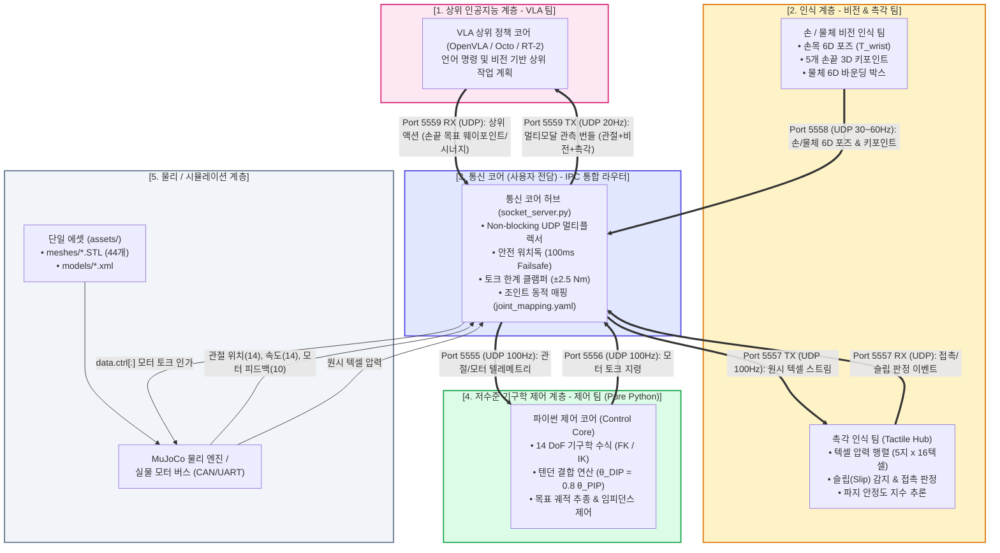
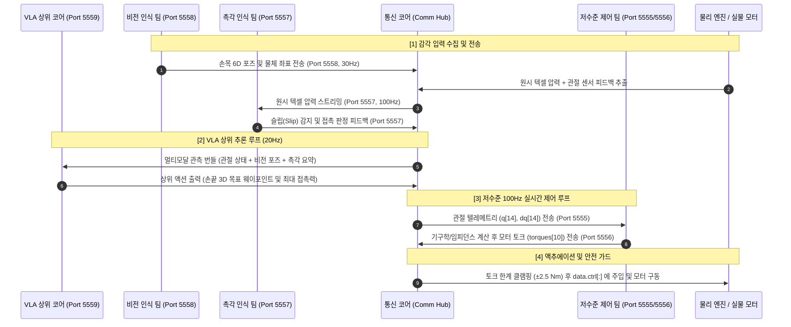

# 14 DoF 그리퍼 다중 팀 통합 데이터 플로우 & 아키텍처

본 문서는 **통신 코어(Communication Core, 사용자 전담)**를 허브로 하여, **저수준 제어 팀, 촉각 인식 팀, 손/물체 비전 인식 팀, VLA 상위 지능 팀**이 유기적으로 데이터를 주고받는 **전체 시스템 데이터 플로우 및 입출력 포트 명세서**입니다.

---

## 1. 전체 다중 팀 데이터 플로우 다이어그램 (Mermaid Flowchart)

---

## 2. 5대 통신 포트 및 인터페이스 총괄표

| 포트 (Port) | 프로토콜 | 전송 방향 | 협업 대상 팀 | 통신 주기 | 데이터 포맷 | 주요 역할 |
| :---: | :---: | :---: | :---: | :---: | :---: | :--- |
| **`5555`** | UDP | Comm $\rightarrow$ Control | **저수준 제어 팀** | 100 Hz (10ms) | JSON | 14개 관절 각도/속도, 10개 모터 실제 토크 |
| **`5556`** | UDP | Control $\rightarrow$ Comm | **저수준 제어 팀** | 최대 100 Hz | JSON | 10개 모터 지령 토크 (100ms 워치독 보호) |
| **`5557`** | UDP | Comm $\leftrightarrow$ Tactile | **촉각 인식 팀** | 100 ~ 200 Hz | JSON | 원시 텍셀 압력 행렬 $\leftrightarrow$ 슬립/접촉 이벤트 |
| **`5558`** | UDP | Vision $\rightarrow$ Comm | **손/물체 비전 팀** | 30 ~ 60 Hz | JSON | 손목 6D 포즈, 손끝 3D 키포인트, 타깃 물체 포즈 |
| **`5559`** | UDP | Comm $\leftrightarrow$ VLA | **VLA 상위 지능 팀** | 10 ~ 30 Hz | JSON | 멀티모달 상태 관측치 $\leftrightarrow$ 상위 작업 액션 지령 |

---

## 3. 실시간 통합 제어 시퀀스 (Sequence Diagram)

