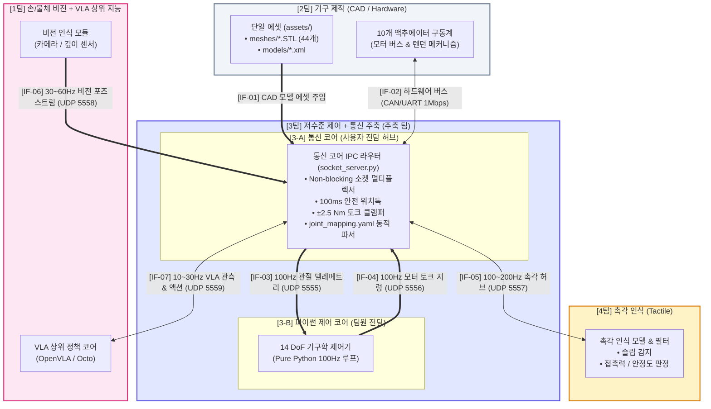

# 14 DoF 로봇 핸드 4대 팀별 시스템 인터페이스 협약서 (SYSTEM_INTERFACE_CONTRACT)

본 문서는 **1팀(비전+VLA)**, **2팀(기구 제작)**, **3팀(저수준 제어+통신 주축)**, **4팀(촉각 인식)** 간의 원활한 정보 공유와 무결점 통합을 위해 제정된 **공식 시스템 인터페이스 계약(Interface Contract) 및 구속 조건 명세서**입니다.

모든 팀은 하위 시스템 개발 시 본 문서에 정의된 **인터페이스 ID(`[IF-XX]`), 포트/토픽 명칭, 최소/최대 발행 주기, 데이터 구조, 안전 제약 구속 조건**을 반드시 준수해야 합니다.

---

## 1. 4대 팀 구조 및 역할 정의 (Team Structure)

```
[1팀] 손 / 물체 비전 + VLA 상위 지능
  ├─ 1-A: 손목 6D 포즈 & 5지 3D 키포인트 추적
  ├─ 1-B: 타깃 물체 6D 바운딩 박스 인식
  └─ 1-C: VLA(Vision-Language-Action) 상위 작업 계획 및 목표 웨이포인트 추론

[2팀] 기구 제작 및 모델링 (Mechanical Design)
  ├─ 2-A: 14 DoF 3D CAD 설계, STL 메시 추출, 3D 프린팅 / 가공
  ├─ 2-B: 단일 에셋(assets/) 관리 및 URDF / MuJoCo XML 모델 갱신
  └─ 2-C: 모터 배치, 텐던 라우팅(0.8 결합비 풀리 설계), 하드웨어 배선(CAN/UART)

[3팀] 저수준 제어 + 통신 주축 (Low-Level Control & Comm Core) - 주축 팀
  ├─ 3-A (사용자 전담): 통신 코어 IPC 허브, 5채널 소켓 멀티플렉서, 안전 워치독, 하드웨어/시뮬 브릿지
  └─ 3-B (동료 팀원 전담): 100Hz 파이썬 순수 제어기, 14 DoF 기구학(FK/IK), 모터 토크 생성

[4팀] 촉각 인식 (Tactile Perception)
  ├─ 4-A: 손끝 5지 텍셀(Taxel) 어레이 원시 데이터 수집
  ├─ 4-B: 슬립(Slip) 감지 및 3축 접촉력(Fn, Ft) 추정
  └─ 4-C: 실시간 파지 안정도(Grasp Stability) 평가
```

---

## 2. 인터페이스 매칭 전체 다이어그램 (Interface Flow Diagram)

다이어그램의 각 연결선에 부여된 **`[IF-01]` ~ `[IF-07]` 식별 번호**는 제3절의 **구속 조건 명세표**와 1:1로 정확하게 일치합니다.



---

## 3. 인터페이스 구속 조건 총괄 명세표 (Interface Requirements Table)

다이어그램의 식별 번호(`[IF-XX]`)와 일치하는 세부 구속 조건입니다. 모든 팀은 이 표의 **주기, 보드레이트, 안전 제약 조건**을 필수 준수해야 합니다.

| ID | 송신 $\rightarrow$ 수신 팀 | 통신 방식 (소켓 포트 / ROS 토픽) | 발행 주기 (최소 ~ 최대) | 보드레이트 / 대역폭 | 데이터 구조 및 주요 필드 | 필수 구속 조건 및 불변식 (Constraints & Invariants) |
| :---: | :---: | :---: | :---: | :---: | :---: | :--- |
| **`[IF-01]`** | 2팀 $\rightarrow$ 3팀 | 파일 시스템 단일 에셋 주입 | 변경 시 즉시 | N/A (디스크 I/O) | `assets/meshes/*.STL`<br>`assets/models/*.xml` | • STL은 반드시 `assets/meshes/`에만 단일 보관할 것.<br>• XML 컴파일러 태그는 `<compiler meshdir="../meshes"/>`로 고정할 것.<br>• 관절 명칭 변경 시 `joint_mapping.yaml`에 반영할 것. |
| **`[IF-02]`** | 3팀 $\leftrightarrow$ 2팀 | CAN Bus / RS-485 Serial UART | 100 Hz $\pm 1\text{ms}$ (10ms) | **1,000,000 bps** (1 Mbps 고정) | 10개 모터 패킷<br>(ID, Pos, Vel, Current) | • 모터 ID는 $1 \sim 10$번으로 고정.<br>• 최대 허용 전류 초과 방지 드라이버단 하드웨어 퓨즈 필수.<br>• 1회 통신 프레임 지연 < 1.5ms 유지. |
| **`[IF-03]`** | 3-A $\rightarrow$ 3-B | UDP Socket (`127.0.0.1:5555`)<br>*(ROS: `/gripper/telemetry`)* | **100 Hz 고정** (10 ms) | 로컬 루프백<br>(지연 < 0.1ms) | JSON 문자열<br>`q[14]`, `dq[14]`, `actuator_pos[10]`, `actuator_torque[10]` | • 14개 관절 인덱스는 `joint_mapping.yaml` 순서($0\sim13$) 엄수.<br>• 단위: 위치 $\text{rad}$, 속도 $\text{rad/s}$, 토크 $\text{Nm}$.<br>• 제어팀은 논블로킹 최신 1프레임만 수신할 것. |
| **`[IF-04]`** | 3-B $\rightarrow$ 3-A | UDP Socket (`127.0.0.1:5556`)<br>*(ROS: `/gripper/torque_command`)* | 50 Hz ~ **100 Hz** (10~20ms) | 로컬 루프백<br>(지연 < 0.1ms) | JSON 문자열<br>`mode: "torque"`,<br>`torques[10]` | • **안전 워치독 구속 조건**: 100ms 초과 미수신 시 3-A팀이 전 모터 출력 $0.0\text{ Nm}$ 강제 차단.<br>• **토크 클램핑**: 엄지 $\pm 1.8\text{ Nm}$, 손가락 $\pm 2.5\text{ Nm}$ 초과분 강제 절삭. |
| **`[IF-05]`** | 3-A $\leftrightarrow$ 4팀 | UDP Socket (`127.0.0.1:5557`)<br>*(ROS: `/tactile/taxel_stream`)* | **100 Hz ~ 200 Hz** (5~10ms) | 약 250 KB/s 대역폭 | **TX**: `taxels` (5지 $\times$ 16값)<br>**RX**: `slip_detected[5]`, `normal_forces[5]` | • 4팀의 슬립/접촉 감지 알고리즘 연산 지연시간은 20ms 이내일 것.<br>• 센서 노이즈 필터링(LPF 50Hz)은 4팀 내부에서 완료하여 전달할 것. |
| **`[IF-06]`** | 1팀 $\rightarrow$ 3-A | UDP Socket (`127.0.0.1:5558`)<br>*(ROS: `/perception/wrist_pose`)* | **30 Hz ~ 60 Hz** (16~33ms) | 약 50 KB/s 대역폭 | JSON 문자열<br>`palm_pose`, `fingertip_keypoints_3d`, `target_object` | • 좌표계 표준: **ROS REP-103 표준 준수** (X 전방, Y 좌측, Z 상향, 단위: 미터).<br>• 카메라 광학 좌표계일 경우 광학계 변환 행렬($T_{c2b}$) 필수 표기.<br>• 타깃 신뢰도(`confidence`) 0.7 미만 시 플래그 0 전송. |
| **`[IF-07]`** | 3-A $\leftrightarrow$ 1팀 | UDP Socket (`127.0.0.1:5559`)<br>*(ROS: `/vla/action_stream`)* | **10 Hz ~ 30 Hz** (33~100ms) | 약 20 KB/s 대역폭 | **TX**: 관측치 번들<br>**RX**: `target_fingertip_waypoints`, `synergy_mode` | • VLA 액션은 급격한 Step 지령 금지 (최대 속도 $\le 0.15\text{ m/s}$ 스무딩 필수).<br>• 파지 모드: `"pinch"`, `"power"`, `"tripod"` 표준 문자열 사용.<br>• 최대 접촉력 상한선(`max_contact_force_limit_N`) 필드 필수 포함. |

---

## 4. 팀별 필수 준수 구속 조건 상세 (Mandatory Guidelines by Team)

### [1팀: 비전 및 VLA 팀 필수 준수 사항]
1. **좌표계 및 단위**: 모든 공간 위치는 **미터($\text{m}$)**, 각도는 **라디안($\text{rad}$)** 및 **쿼터니언($[q_x, q_y, q_z, q_w]$)** 정규화 형태를 유지해야 합니다.
2. **레이턴시 상한선**: 비전 인식 및 VLA 토큰 생성의 총 지연 시간은 **최대 100ms(10Hz)**를 넘지 않아야 하며, 추론 지연이 발생할 경우 3팀의 워치독이 발동하지 않도록 심장박동(Heartbeat/Keep-alive) 패킷을 유지해야 합니다.
3. **급격한 위치 뜀(Jumping) 방지**: VLA가 출력하는 손끝 목표 웨이포인트는 10ms 단위로 3팀 제어기가 추종하므로, 프레임 간 변위가 $15\text{ mm}$ 이상 급변하지 않도록 1팀 내부에서 1차 보간을 권장합니다.

### [2팀: 기구 제작 팀 필수 준수 사항]
1. **단일 에셋 경로 규칙**: 모든 3D STL 파일은 반드시 [`robotic_hand_ws/assets/meshes/`](file:///c:/MVP_project/literature/robotic_hand_ws/assets/meshes/) 단 한 곳에만 저장해야 하며, 서브 패키지 내부에 중복 복사본을 만들지 않습니다.
2. **메쉬 좌표계 원점**: 각 링크의 STL 원점은 **해당 관절의 회전 축 중심(Center of Rotation)**에 일치시켜야 기구학 오차가 발생하지 않습니다.
3. **텐던 결합비 보존**: 검지, 중지, 약지, 소지의 DIP 관절 결합 텐던비는 기구적으로 **$\theta_{DIP} = 0.8 \cdot \theta_{PIP}$**가 되도록 풀리 반경을 가공·조립해야 합니다.
4. **통신 보드레이트**: 실제 모터 구동 보드(CAN / RS485)는 **1,000,000 bps (1 Mbps)** 통신 속도로 펌웨어 파라미터를 고정합니다.

### [3팀: 저수준 제어 및 통신 주축 팀 필수 준수 사항]
1. **통신 코어 (3-A, 사용자)**:
   - 100Hz 타이머 주기를 엄격히 준수하며, 지터(Jitter)는 $\pm 1\text{ ms}$ 이내로 제어합니다.
   - 100ms 동안 제어 패킷이 단절되면 즉시 하드웨어 및 MuJoCo의 모터 토크를 $0.0\text{ Nm}$로 강제 차단합니다.
   - 1팀의 VLA 지령(`Port 5559`), 비전 포즈(`Port 5558`), 4팀의 촉각 이벤트(`Port 5557`)를 취합하여 3-B 제어팀에 투명하게 중계합니다.
2. **제어 코어 (3-B, 동료 팀원)**:
   - ROS 2나 C++ 없이 순수 파이썬 환경에서 `socket` 라이브러리를 논블로킹(`setblocking(False)`)으로 열어 버퍼 지연(Zero-latency) 없이 최신 1프레임만 취득합니다.
   - 10개 모터 출력 토크는 규정된 한계치($\pm 1.8\text{ Nm}, \pm 2.5\text{ Nm}$)를 준수하여 계산합니다.

### [4팀: 촉각 인식 팀 필수 준수 사항]
1. **텍셀 데이터 순서**: 5개 손가락의 텍셀 어레이 순서는 `thumb(0) -> index(1) -> middle(2) -> ring(3) -> pinky(4)` 인덱스를 고정 준수합니다.
2. **실시간성**: 슬립 감지 플래그(`slip_detected`)는 슬립 발생 시점으로부터 **20ms 이내**에 통신 코어로 리턴되어야 3팀 제어기가 물체 낙하 방지 보상 토크를 즉시 인가할 수 있습니다.
